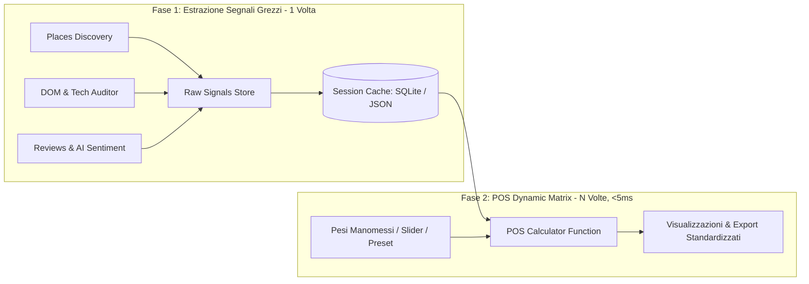
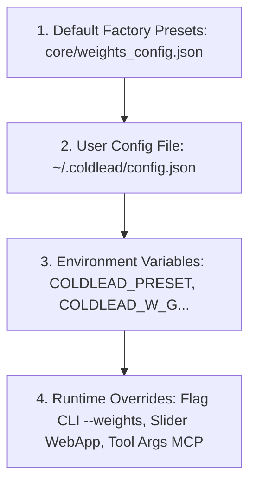
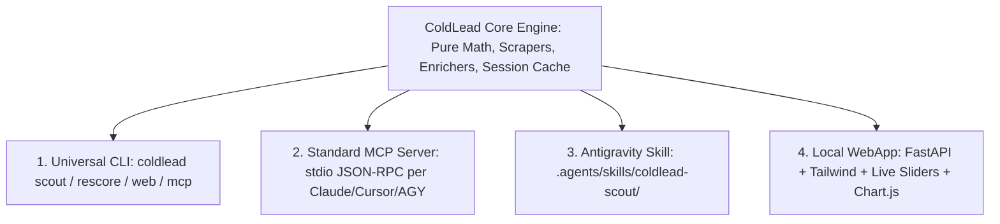

# 🎯 ColdLead Studio — Master Project Vision & Architecture Specification

> **Documento Direttivo per Coding Agent & Core Engineering**  
> **Versione:** 1.0.0  
> **Target:** Sviluppo di un tool open-source ad alto impatto per GitHub, CLI universale, server MCP, Antigravity Skill e WebApp locale per lo scouting scientifico B2B orientato al **VibeCoding**.

---

## 1. Executive Summary & Visione Strategica

### 1.1 Il Problema del Lead Generation Tradizionale
I comuni scraper B2B (Google Maps scraper, directory extractor) estraggono semplici liste di contatti (nome, telefono, email, rating). Questo approccio genera:
1. **Liste indifferenziate a basso rendimento**: nessuna indicazione su chi ha davvero i soldi per pagare o chi è pronto a comprare.
2. **Pitch generici e inefficaci**: le agenzie inviano proposte standardizzate ("Ti rifaccio il sito a 1.500€") che finiscono nello spam o vengono ignorate.
3. **Spreco di tempo con clienti tossici**: nessun filtro preventivo intercetta titolari litigiosi o aziende a rischio insolvenza prima del contatto.

### 1.2 Il Paradigma "VibeCoding Prospecting"
Nel **VibeCoding** (sviluppo software accelerato da agenti AI come Cursor, Antigravity e Claude), non vendiamo un semplice restyling di un sito vetrina in 3 mesi. Vendiamo **soluzioni digitali ad altissimo valore realizzabili in 24-48 ore**:
- **Calcolatori e Configuratori Istantanei** (es. calcolatore prezzi charter nautico con extra e disponibilità).
- **Menù Digitali Dinamici & Micro-App** (sostituzione di PDF lenti con app reattive con filtri allergeni e prenotazione WhatsApp).
- **AI Agent Operativi & Customer Care** (bot WhatsApp per FAQ e prenotazioni, risponditore recensioni in tono di voce del brand).
- **Replatforming Ultra-Fast** (migrazione da CMS lenti come vecchi WordPress/Joomla a Next.js/Tailwind con 100/100 Lighthouse).

### 1.3 La Missione del Prodotto
Creare **ColdLead Studio**: un motore scientifico open-source che:
1. Raccoglie i segnali oggettivi grezzi delle aziende locali/di nicchia.
2. Calcola il **Precision Opportunity Score (POS)** tramite una formula matematica a 8 variabili normalizzate e moltiplicatori.
3. Consente la **manomissione manuale dei pesi POST-SCRAPING** in tempo reale su qualsiasi interfaccia.
4. Genera automaticamente un **Action Kit di Outreach chirurgico** (Loom Script da 90s, Cold Email, WhatsApp opener, e Prompt VibeCoding per generare il prototipo).
5. È distribuito in 4 superfici: **CLI unificata (`coldlead`)**, **Server MCP (Model Context Protocol)**, **Skill per Antigravity/AGY**, e **Local WebApp reattiva**.

---

## 2. Il Modello Matematico: *Precision Opportunity Score* ($POS_{vibe}$)

L'equazione normalizza tutti i fattori restituendo un punteggio compreso tra **0 e 100**:

$$\mathbf{POS} = \left[ \frac{\sum (w_i \cdot V_i)}{\sum w_i} \times 10 \right] \times M_{Ads} \times M_{Friction} \times T_{win}$$

### 2.1 Le 8 Variabili Normalizzate ($V_i \in [0.0, 10.0]$)

| Simbolo | Nome Variabile | Peso Default ($w_i$) | Descrizione e Metodo di Calcolo |
| :---: | :--- | :---: | :--- |
| **$G_{dig}$** | **Digital & AI Readiness Gap** | **3.0** | Misura l'obsolescenza digitale: punteggio Google Lighthouse invertito, CMS legacy (WordPress 4.x, Joomla, Wix lento), assenza di viewport mobile o assenza totale di sito web (se non hanno sito = 10.0). |
| **$V_{ticket}$** | **Valore Ticket & Margine** | **2.5** | Margine del settore merceologico: settori alto spendenti (charter yacht, ville di lusso, boutique hotel, cliniche, chirurgia, NCC) valgono 9.0-10.0; ristorazione/bar valgono 3.0-6.0. Un aumento di conversioni del 5% per loro vale migliaia di euro. |
| **$F_{fin}$** | **Solidità Finanziaria & Forma Giuridica** | **2.0** | Capacità di spesa: S.p.A. / S.r.l. storica con dipendenti = 9.0-10.0; S.r.l.s. o S.n.c. = 5.5-6.5; Ditta individuale minuscola senza dipendenti = 2.0-3.0 (alto rischio di trattativa al ribasso o insolvenza). |
| **$C_{press}$** | **Pressione Competitiva Locale** | **1.5** | Asimmetria con i competitor: misura se i primi 2 concorrenti diretti nella stessa città dominano le ricerche con siti veloci, booking online e recensioni migliori. |
| **$M_{reach}$** | **Frizione Mercato Estero** | **1.5** | Disallineamento internazionale: attività che operano in hub turistici o di lusso internazionali (es. Portofino, Costa Smeralda, Firenze, Como) che hanno siti **solo in italiano** o con traduzioni rotte. |
| **$A_{decision}$** | **Accessibilità Decision Maker** | **1.5** | Facilità di raggiungere chi stacca l'assegno: titolare rintracciabile direttamente (WhatsApp aziendale, LinkedIn, cellulare diretto) = 9.0; catena o franchising centralizzato con direzione altrove = 1.0-2.0. |
| **$B_{care}$** | **Brand Care & Sensibilità Digitale** | **1.0** | Comportamento del titolare online: frequenza e tempestività delle risposte alle recensioni Google (risponde ad ogni recensione con cortesia = 9.0; zero risposte e totale abbandono = 2.0). |
| **$U_{vibe}$** | **Superficie VibeCoding (Automation Potential)** | **1.0** | Presenza di processi manuali inefficienti che possono essere rimpiazzati in 24h con un micro-tool (es. menù PDF da 15MB, form di contatto generico invece di calcolatore preventivi, assenza bot FAQ). |

*(Somma totale pesi default: $\sum w_i = 14.0$. Il valore in parentesi quadre è scalato su base 100).*

### 2.2 Moltiplicatori di Contesto
- **$M_{Ads}$ (Moltiplicatore Pubblicità)**:
  - **1.25** se l'azienda ha campagne attive (Meta Ads Library o Google Ads). *Razionale: stanno spendendo budget pubblicitario indirizzandolo verso un sito che perde conversioni; hanno urgenza immediata di convertire meglio*.
  - **1.0** se non fanno ads.
- **$M_{Friction}$ (Colli di Bottiglia Critici)**:
  - **1.15** se riscontrati errori gravi come assenza di certificato SSL (HTTP non sicuro) o viewport mobile non responsive.
  - **1.0** altrimenti.
- **$T_{win}$ (Finestra Temporale / Stagionalità)**:
  - **1.4** (Autunno / Inverno - Ottobre/Febbraio per turismo e attività stagionali): hanno appena incassato, hanno tempo libero per pianificare la stagione successiva.
  - **1.0** (Primavera - Marzo/Aprile o attività annuali): urgenza alta prima delle aperture.
  - **0.5** (Piena Estate - Giugno/Agosto per turismo): operatività frenetica, zero tempo per parlare di progetti digitali.

### 2.3 Penalty Filter & Red Flags ($P_{risk}$ — Scarto Immediato)
Prima di investire anche solo 1 minuto nella creazione di un mockup o di un video Loom, il sistema applica i filtri di esclusione immediata:
1. **Titolare Tossico / Litigioso**: risponde alle recensioni negative insultando i clienti, minacciando querele o denunciando "falsi profili" (intercettato tramite NLP/sentiment Gemini). $\to$ **SCARTA SUBITO (Tier Discard)**.
2. **Procedura Concorsuale / Insolvenza**: stato di liquidazione, fallimento o concordato preventivo. $\to$ **SCARTA SUBITO**.
3. **Forte Vendor Lock-in**: footer con "Made by Agenzia XYZ" aggiornato e strutturato. $\to$ **PENALITÀ O DISCARD** (hanno contratti con canone o vincoli contrattuali difficili da strappare).

### 2.4 Soglie di Azione Operativa
- **$POS \ge 85$ (Tier 1 — Hot Lead)**: Richiede un approccio ad alto valore. Fai un video Loom da 90s mostrando il bug del sito su mobile e invia un micro-prototipo interattivo. Conversione attesa: **> 20%**.
- **$65 \le POS < 85$ (Tier 2 — Warm Lead)**: Approccio tramite cold email personalizzata con 2 screenshot specifici dei problemi riscontrati.
- **$POS < 65$ (Tier 3 — Discard)**: Opportunità a basso rendimento. Non sprecare tempo.

---

## 3. Principio Fondamentale: Disaccoppiamento tra Scraping e Scoring

### 3.1 Il Principio Chiave
> **Lo Scraping e l'analisi tecnica/psicologica sono pesanti e lenti. Il calcolo del punteggio deve essere istantaneo e ricalcolabile all'infinito senza rieseguire lo scraping.**

Non ha senso rieseguire lo scraping solo per cambiare l'importanza del fattore automazione ($w_A$) o del fattore ticket ($w_T$).



### 3.2 La Session Cache Locale
Ogni operazione di scraping salva i **segnali oggettivi grezzi** in una cache locale persistente:
- Path: `~/.coldlead/cache/` oppure `.coldlead/session.json`.
- Struttura:
  - Metadati azienda (nome, indirizzo, telefono, email, P.IVA, forma giuridica).
  - Dati tecnici (Lighthouse performance score, mobile friendly, SSL, CMS rilevato, crediti agenzia, presenza booking).
  - Dati reputazione (numero recensioni, rating medio, tasso di risposta del titolare, sentiment classificato dall'AI, campioni di risposte).
  - Spesa pubblicitaria (flag ads attive rilevate).

Quando l'utente:
- Muove uno slider nella WebApp
- Esegue `coldlead rescore --weights ...` da CLI
- Chiede a Claude o all'agente MCP di ricalcolare i punteggi con un preset diverso

**Il sistema legge i segnali grezzi dalla cache locale e ricalcola tutti i punteggi in meno di 5 millisecondi, aggiornando la classifica e i grafici radar in tempo reale.**

---

## 4. Contratto Dati Standardizzato: Schema JSON v1.0.0

Per garantire la massima interoperabilità tra CLI, WebApp, MCP e altri tool, tutti i moduli devono rispettare il seguente schema formale (`POSLeadDossier`):

```json
{
  "$schema": "https://json-schema.org/draft/2020-12/schema",
  "schema_version": "1.0.0",
  "id": "lead_a1b2c3d4",
  "company": {
    "name": "Portofino Charter Deluxe S.r.l.",
    "niche": "Charter nautico e noleggio barche",
    "city": "Santa Margherita Ligure",
    "address": "Banchina Sant'Erasmo 12",
    "phone": "+39 0185 000001",
    "email": "info@portofinocharterdeluxe.example",
    "vat_number": "IT01234567890",
    "legal_form": "S.r.l.",
    "direct_contact_person": "Marco Benvenuti",
    "contact_channels": ["WhatsApp Diretto", "Telefono", "Email"]
  },
  "raw_signals": {
    "has_website": true,
    "website_url": "https://portofinocharterdeluxe.example.it",
    "lighthouse_performance": 38,
    "mobile_friendly": true,
    "has_ssl": true,
    "cms_stack": "WordPress (Elementor)",
    "has_multilingual": false,
    "has_booking_system": false,
    "has_ai_chat": false,
    "footer_agency_credit": null,
    "reviews_count": 84,
    "average_rating": 4.7,
    "owner_reply_rate": 85.0,
    "owner_sentiment_tone": "Empathetic & Professional",
    "is_toxic_owner": false,
    "sample_owner_replies": ["Gentile James, grazie per aver scelto il nostro gozzo..."],
    "is_running_ads": true
  },
  "pos_evaluation": {
    "final_score": 100.0,
    "raw_score": 71.4,
    "tier": "Tier 1 — Hot Lead (POS >= 85)",
    "is_discarded": false,
    "discard_reasons": [],
    "variables": {
      "G_dig": 4.7,
      "V_ticket": 9.5,
      "F_fin": 9.0,
      "C_press": 5.0,
      "M_reach": 9.5,
      "A_decision": 9.0,
      "B_care": 9.0,
      "U_vibe": 10.0
    },
    "weights_applied": {
      "w_G": 3.0,
      "w_T": 2.5,
      "w_F": 2.0,
      "w_P": 1.5,
      "w_I": 1.5,
      "w_D": 1.5,
      "w_C": 1.0,
      "w_A": 1.0
    },
    "multipliers_applied": {
      "m_ads": 1.25,
      "m_friction": 1.0,
      "t_win": 1.4
    },
    "recommendation": "HOT LEAD: Richiede video Loom da 90s personalizzato o micro-mockup VibeCoding. Conversione attesa > 20%."
  },
  "action_kit": {
    "vibe_opportunity_summary": "Creare un calcolatore istantaneo per charter con selezione barca, skipper ed extra in 3 lingue (IT/EN/DE).",
    "loom_script_90s": "...",
    "cold_email": "...",
    "whatsapp_opener": "...",
    "vibecoding_prompt": "..."
  }
}
```

---

## 5. Gerarchia delle Configurazioni (Personalizzazione Ovunque)

Ogni parametro (pesi $w_i$, moltiplicatori, soglie dei Tier) deve essere configurabile con una gerarchia di precedenza a cascata ben definita:



### Preset Predefiniti:
1. `default_vibe_coding`: Bilanciato per micro-tool, portali e restyling veloci.
2. `automation_first`: Massima priorità a processi manuali e automazioni ($w_A = 3.0, w_D = 2.0$).
3. `high_ticket_luxury`: Focus su yacht, ville, cliniche e clientela estera ($w_T = 3.5, w_I = 2.5$).
4. `speedy_cashflow`: Focus su siti disastrosi ma titolari facilmente raggiungibili ($w_G = 4.0, w_D = 3.0$).

---

## 6. Architettura delle 4 Superfici del Prodotto



### 6.1 Superficie 1: Universal CLI (`coldlead`)
Sviluppata con `argparse` o `click` e stilizzata con **`rich`**:
- `coldlead scout "<nicchia>" "<città>" [--limit 10] [--preset <nome>]`: Esegue lo scraping, memorizza i segnali nella session cache e stampa la tabella formattata a colori.
- `coldlead rescore [--preset <nome>] [--weights '{"w_A": 4.0}'] [--format <fmt>]`: **Ricalcola istantaneamente i lead già presenti in cache senza rifare lo scraping.**
- `coldlead web [--port 8000]`: Avvia il backend FastAPI e apre in automatico il browser su `http://127.0.0.1:8000`.
- `coldlead mcp`: Avvia il server stdio JSON-RPC.
- `coldlead kit <lead_id>`: Stampa l'Action Kit completo del lead.
- `coldlead export --format [csv|json|compact|markdown]`: Esporta i lead attuali.

### 6.2 Superficie 2: Server MCP (Model Context Protocol)
Standard aperto (protocollo JSON-RPC 2.0 over stdio) compatibile nativamente con **Claude Code**, **Claude Desktop**, **Antigravity CLI (`agy`)**, **Cursor** e **Windsurf**.
- Tool esposti:
  - `coldlead_search(niche, location, limit, preset)`: Ricerca e calcolo iniziale.
  - `coldlead_rescore(custom_weights, season, preset)`: **Ricalcolo istantaneo post-scraping da chat AI.**
  - `coldlead_audit(url)`: Audit tecnico di un singolo sito.
  - `coldlead_score(lead_data, custom_weights)`: Calcolo POS isolato.
  - `coldlead_generate_pitch(company_name, niche, city, opportunity)`: Generazione Action Kit.
  - `coldlead_open_dashboard()`: Avvia la WebApp e apre il browser su comando dell'AI.

### 6.3 Superficie 3: Antigravity Skill (`coldlead-scout`)
Registrata in `.agents/skills/coldlead-scout/SKILL.md` (e globalmente in `~/.gemini/config/skills/`):
- Permette all'agente di condurre sessioni di prospezione su istruzione dell'utente direttamente nel workspace di sviluppo.

### 6.4 Superficie 4: Local WebApp (Dashboard Interattiva)
Backend FastAPI + Frontend moderno in Tailwind CSS e Chart.js:
- **Sidebar di sinistra**:
  - Parametri di ricerca (Nicchia, Città, Limite, Stagionalità).
  - Selettore Preset.
  - **8 Slider Interattivi per manomettere i pesi in tempo reale**: al rilascio di uno slider, una chiamata asincrona ricalcola tutti i punteggi in < 100ms e riordina i lead a schermo con transizioni fluide.
- **Area Principale**:
  - Badge contatori: Totale, 🔥 Hot Leads, ⚡ Warm Leads, 🛑 Scartati.
  - Pulsanti di esportazione immediata (CSV per CRM, JSON, Markdown).
  - Lead Cards: Punteggio POS circolare, badge Tier, canali di contatto, mini-barre delle 8 metriche, riepilogo dell'opportunità VibeCoding, alert Red Flag.
  - Tasto **"🕸️ Radar"**: apre un modale con il diagramma a ragnatela Chart.js delle 8 dimensioni.
  - Tasto **"🚀 Action Kit"**: apre un modale con 4 tab (Loom 90s, Cold Email, WhatsApp, Prompt VibeCoding) dotati di pulsante "Copia negli appunti".

---

## 7. Mappatura Strumenti & API (Zero Costi di Ingresso)

Il software è progettato per funzionare immediatamente **out-of-the-box a costo zero**:
1. **Modalità Standalone (Senza API Keys)**:
   - Include dataset di benchmark realistici ed euristiche locali sul codice sorgente HTML/DOM per PageSpeed, CMS e sentiment.
   - Chiunque cloni il repository può provarlo in 30 secondi senza inserire chiavi.
2. **Modalità Potenziata (API Keys Opzionali nel `.env`)**:
   - `GEMINI_API_KEY`: per l'analisi psicologica profonda delle recensioni e la classificazione sentiment (quota gratuita di Google AI Studio).
   - `GOOGLE_PLACES_API_KEY`: per il recupero dati Google Maps live a livello globale.
   - `PAGESPEED_API_KEY`: per i dati ufficiali Google Lighthouse.
   - `META_AD_LIBRARY_ACCESS_TOKEN`: per la verifica delle inserzioni pubblicitarie attive.

---

## 8. Specifiche dell'Action Kit di Outreach

Ogni lead Tier 1 o Tier 2 riceve automaticamente un Action Kit generato dinamicamente:

### 1. Loom Video Script (90 Secondi)
- **[00:00 - 00:15] Gancio e Complimento Sincero**: cita le recensioni reali e il posizionamento locale.
- **[00:15 - 00:45] Il Collo di Bottiglia (Frizione Tecnica)**: mostra da smartphone il ritardo di caricamento, la mancanza di multilingua o il modulo statico.
- **[00:45 - 00:75] La Soluzione VibeCoding**: introduce il micro-applicativo funzionante già abbozzato (es. calcolatore o menù interattivo).
- **[00:75 - 00:90] Call to Action a Zero Attrito**: offerta di inviare il link demo su WhatsApp senza impegno.

### 2. Cold Email Chirurgica
- Oggetto contestuale: *"Un dettaglio sul sito di [Nome Azienda] da smartphone ([Città])"*.
- Corpo mail sintetico: Gancio $\to$ Frizione $\to$ Prototipo $\to$ CTA senza pressione.

### 3. WhatsApp Direct Opener
- Testo breve (sotto i 300 caratteri), cordiale, orientato a far provare una demo da mobile.

### 4. VibeCoding Spec Prompt (Per Cursor / Antigravity)
- Prompt strutturato e pronto per essere incollato in un coding agent per generare il codice funzionante del mockup in React/Next.js/Tailwind in meno di 5 minuti.

---

## 9. Struttura dei File del Repository GitHub

```text
ColdLeadSearch/
├── .github/
│   └── workflows/
│       └── ci.yml                 # Test CI multi-OS (Ubuntu, Windows, macOS)
├── coldlead/                      # Modulo principale installabile
│   ├── __init__.py
│   ├── cli.py                     # Entry point 'coldlead'
│   ├── core/
│   │   ├── models.py              # Dataclass & Schema JSON v1.0.0
│   │   ├── pos_calculator.py      # Calcolo matematico puro del POS
│   │   ├── config_manager.py      # Gestore configurazioni a cascata
│   │   ├── weights_config.json    # Preset predefiniti
│   │   └── red_flags.py           # Regole di esclusione immediata
│   ├── scrapers/
│   │   ├── places.py              # Discovery Google Places / Benchmark
│   │   ├── tech_auditor.py        # Lighthouse & DOM Inspector
│   │   ├── ai_enricher.py         # Analisi psicologica Gemini
│   │   └── meta_ads.py            # Verifica campagne Ads
│   ├── storage/
│   │   └── session_cache.py       # Persistenza locale segnali grezzi per rescoring istantaneo
│   ├── presentation/
│   │   ├── terminal_ui.py         # Interfaccia grafica da terminale con Rich
│   │   ├── formatters.py          # Serializzatori JSON, CSV (RFC 4180), Markdown
│   │   └── pitch_generator.py     # Generatore Action Kit (Loom, Email, WhatsApp, Prompt)
│   ├── mcp/
│   │   └── server.py              # Server standard Model Context Protocol (stdio)
│   └── web/
│       ├── app.py                 # Backend FastAPI
│       └── templates/
│           └── index.html         # Frontend Tailwind + Sliders + Chart.js
├── .agents/
│   └── skills/
│       └── coldlead-scout/
│           └── SKILL.md           # Antigravity Skill per AGY CLI e IDE
├── pyproject.toml                 # Packaging standard PEP 621 (pip install -e .)
├── requirements.txt               # Dipendenze con versioni minime
├── .gitignore                     # Protezione secrets (.env, cache, database)
├── .env.example                   # Template variabili ambiente
├── LICENSE                        # Licenza open-source MIT
├── PROJECT_VISION.md              # Questo documento direttivo master
└── README.md                      # Documentazione pubblica per GitHub con badge e guide
```

---

## 10. Istruzioni per il "Coding Agent Super OP"

Quando un coding agent prende in carico questo repository per completare o estendere il progetto, deve attenersi alle seguenti regole tassative:

1. **Non rompere il disaccoppiamento**: Il modulo `storage/session_cache.py` deve sempre memorizzare i dati grezzi estratti. La funzione `calculate_pos()` in `core/pos_calculator.py` deve essere una funzione pura e deterministica senza chiamate di rete.
2. **Supportare la manomissione post-scraping**: Qualsiasi modifica ai pesi (via CLI, WebApp o MCP) deve operare sui dati in cache restituendo la nuova graduatoria all'istante.
3. **Mantenere la compatibilità cross-platform**: Gestire esplicitamente la codifica UTF-8 su Windows terminal (`sys.stdout.reconfigure(encoding='utf-8')`).
4. **Preservare la standardizzazione degli output**: Qualsiasi nuovo formato deve essere conforme ai campi definiti in `POSLeadDossier` (Schema v1.0.0).
5. **Zero-Friction First**: Garantire che il comando `coldlead scout` funzioni anche a computer disconnesso o senza chiavi API configurate, usando i benchmark contestuali realistici.
