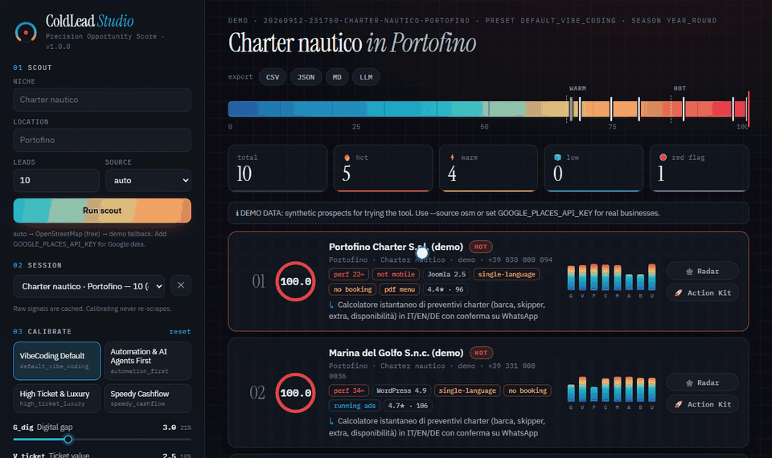

<div align="center">

# 🎯 ColdLead Studio

**Scrape una volta. Ricalcola all'infinito.**
Lead scouting B2B scientifico per studi VibeCoding: trova le attività locali che hanno più
bisogno (e budget) di una micro-app realizzabile in 24 ore, ordinale con un modello trasparente a
8 variabili e ottieni un kit di outreach pronto da inviare.

[English](README.md) · [Italiano](README.it.md)



</div>

---

## Perché

Gli scraper classici restituiscono liste piatte di nomi e numeri. Non dicono **chi ha soldi, chi è
raggiungibile, chi è tossico e cosa proporgli**. ColdLead Studio risponde a queste domande con
numeri verificabili:

- 🧮 **Precision Opportunity Score (POS, 0–100)**: 8 variabili normalizzate, moltiplicatori di
  contesto e filtri red flag — ogni punto è spiegato.
- ⚡ **Scoring disaccoppiato**: il lavoro lento (discovery, audit dei siti, insight AI) avviene una
  volta sola e finisce in cache. Ricalcolare con pesi diversi è matematica pura: **~1 ms a sessione**.
- 🎛️ **Manomissione dei pesi post-scraping** da slider, flag CLI o argomenti MCP — oppure un preset.
- 🚀 **Action Kit per ogni lead**: script Loom da 90 secondi, cold email chirurgica, opener WhatsApp
  (< 300 caratteri) e prompt VibeCoding per generare il prototipo con Cursor / Claude Code / Antigravity.
- 🆓 **Costo zero di default**: funziona offline con dati demo realistici o live e gratis con
  OpenStreetMap. Le API key servono solo a potenziare.

## Avvio rapido

```bash
uv tool install "coldlead-studio[all] @ git+https://github.com/gabrielecrema/coldlead-studio"

coldlead scout "Charter nautico" "Portofino" --source demo   # 30 secondi, niente chiavi né rete
coldlead rescore -p high_ticket_luxury                       # nuova classifica istantanea dalla cache
coldlead explain 1                                           # perché il #1 è in cima?
coldlead kit 1                                               # kit di outreach per il #1
coldlead web                                                 # dashboard interattiva
```

Puoi anche cercare intorno a un punto preciso: `coldlead scout "nautico" --near 44.35,9.15 -r 3` (o il pulsante 📍 nella dashboard); se i risultati sono meno del limite, l'area si allarga da sola fino a 25 km.

Senza `--source demo` lo scouting usa **attività reali** (Google Places se hai la chiave,
altrimenti OpenStreetMap, gratis) con audit tecnico live di ogni sito.

## Il modello

$$\mathrm{POS} = \left[\frac{\sum_i w_i \cdot V_i}{\sum_i w_i} \times 10\right] \times M_{ads} \times M_{friction} \times T_{win}\;(\times P_{lock\text{-}in})$$

| Peso | Variabile | Default | Cosa misura |
|:---:|---|:---:|---|
| `w_G` | **G_dig** — Gap digitale | 3.0 | Performance, mobile, HTTPS, CMS obsoleto, booking — o sito assente (= 10) |
| `w_T` | **V_ticket** — Valore ticket | 2.5 | Margini del settore: charter ≫ bar |
| `w_F` | **F_fin** — Solidità finanziaria | 2.0 | Forma giuridica (S.p.A./S.r.l. vs ditta individuale) e dipendenti |
| `w_P` | **C_press** — Pressione competitiva | 1.5 | Quanto i 2 migliori concorrenti locali della sessione sono avanti online |
| `w_I` | **M_reach** — Frizione mercato estero | 1.5 | Hub turistici/lusso con sito solo in italiano |
| `w_D` | **A_decision** — Accesso al titolare | 1.5 | Titolare su WhatsApp/cellulare vs catena con sede altrove |
| `w_C` | **B_care** — Cura del brand | 1.0 | Frequenza e tono delle risposte alle recensioni |
| `w_A` | **U_vibe** — Superficie VibeCoding | 1.0 | Processi manuali sostituibili in 24h (menù PDF, niente booking, niente bot) |

**Moltiplicatori**: ads attive ×1.25 · frizione critica (no HTTPS / non mobile) ×1.15 · stagionalità
×1.4 autunno-inverno, ×1.0 primavera, ×0.5 piena estate (`--season auto` la calcola dalla data) ·
lock-in agenzia ×0.85. **Red flag** (scarto immediato): titolare che insulta o minaccia querele,
liquidazione o chiusura. **Tier**: 🔥 Hot ≥ 85 · ⚡ Warm ≥ 65 · 🧊 Low.

Specifica completa in [docs/scoring.md](docs/scoring.md) · visione originale in [PROJECT_VISION.md](PROJECT_VISION.md).

## Le quattro superfici

| Superficie | Come si usa |
|---|---|
| **CLI** | `coldlead scout / rescore / explain / kit / export / import / audit / web / mcp / doctor` |
| **Server MCP** | `claude mcp add coldlead -- coldlead mcp` · per Claude Desktop, Cursor, Windsurf, Antigravity: `{"command": "coldlead", "args": ["mcp"]}` |
| **Skill agente** | [`skills/coldlead-scout/SKILL.md`](skills/coldlead-scout/SKILL.md), sincronizzata in `.claude/skills/` e `.agents/skills/`; il repo è anche un marketplace di plugin Claude Code (`/plugin marketplace add gabrielecrema/coldlead-studio`) |
| **Dashboard** | `coldlead web` — slider live, scala termica, radar, Action Kit IT/EN, export CSV/JSON/MD, **📍 pin sulla mappa** con raggio regolabile |

## Fonti dati e chiavi (tutte opzionali)

| Funzione | Default gratuito | Potenziamento |
|---|---|---|
| Discovery | OpenStreetMap · demo offline · import CSV | `GOOGLE_PLACES_API_KEY` |
| Performance | Stima euristica trasparente | `PAGESPEED_API_KEY` o `--pagespeed` |
| Pubblicità | Rilevamento Meta Pixel / tag Google Ads | `META_AD_LIBRARY_ACCESS_TOKEN` |
| Insight e testi | Euristiche e template deterministici | Gemini · Anthropic · OpenRouter · OpenAI · Ollama locale |

## Configurazione

Gerarchia a cascata: **preset di fabbrica** → **`~/.coldlead/config.json`** → **variabili
d'ambiente** (`COLDLEAD_PRESET`, `COLDLEAD_W_A`, …) → **override runtime**. Crea un file di partenza
con `coldlead config --init`; puoi definire preset personali con `"extends"`.

## Uso responsabile

L'audit legge solo homepage pubbliche, con User-Agent identificativo e rispetto di `robots.txt`.
Sei responsabile del rispetto dei termini delle fonti e della normativa privacy (GDPR: outreach B2B
su legittimo interesse, messaggi pertinenti, opt-out semplice — il template email lo include).
I dati demo sono sintetici e usano domini riservati `.example`.

## Licenza

[MIT](LICENSE) © 2026 Gabriele Crema
