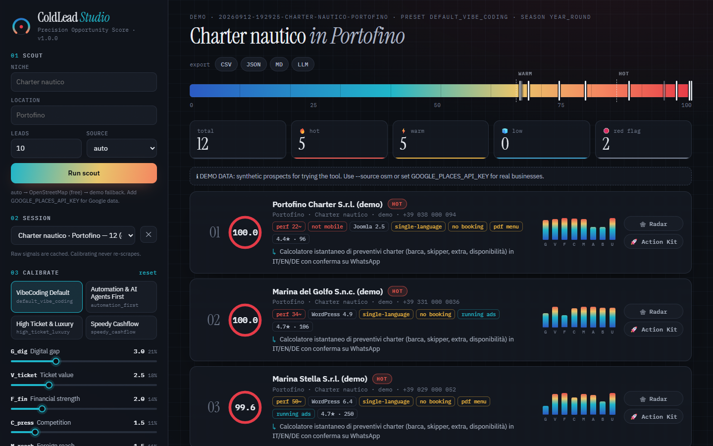
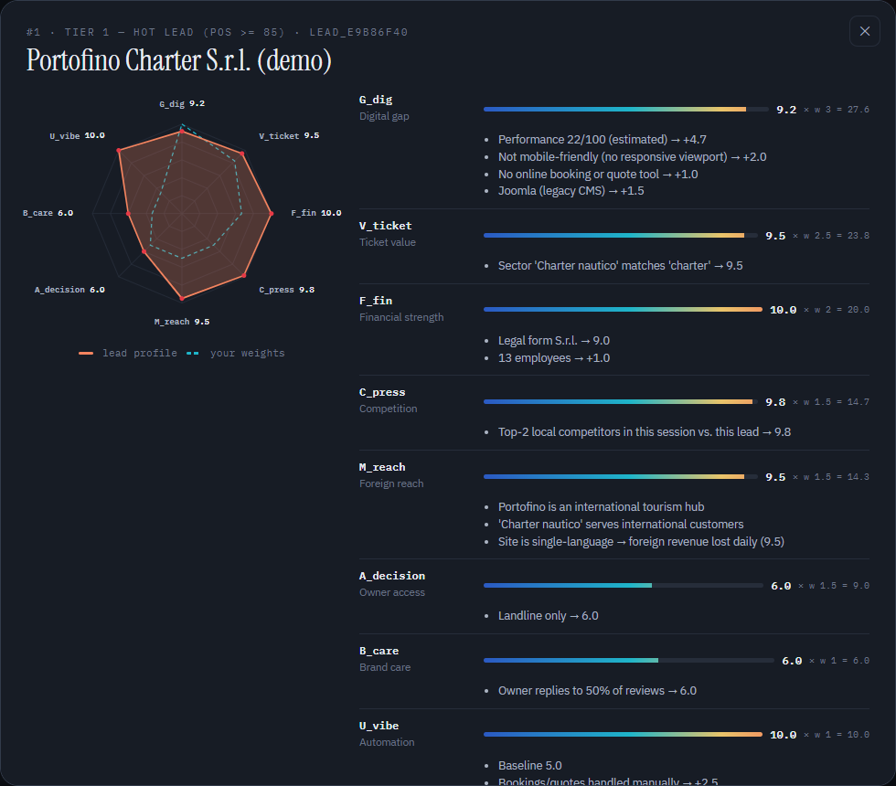
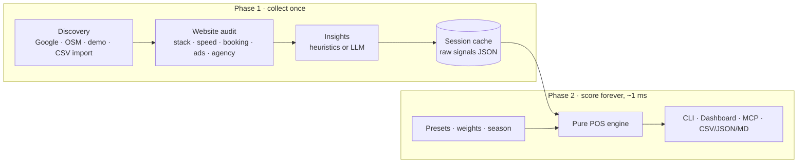
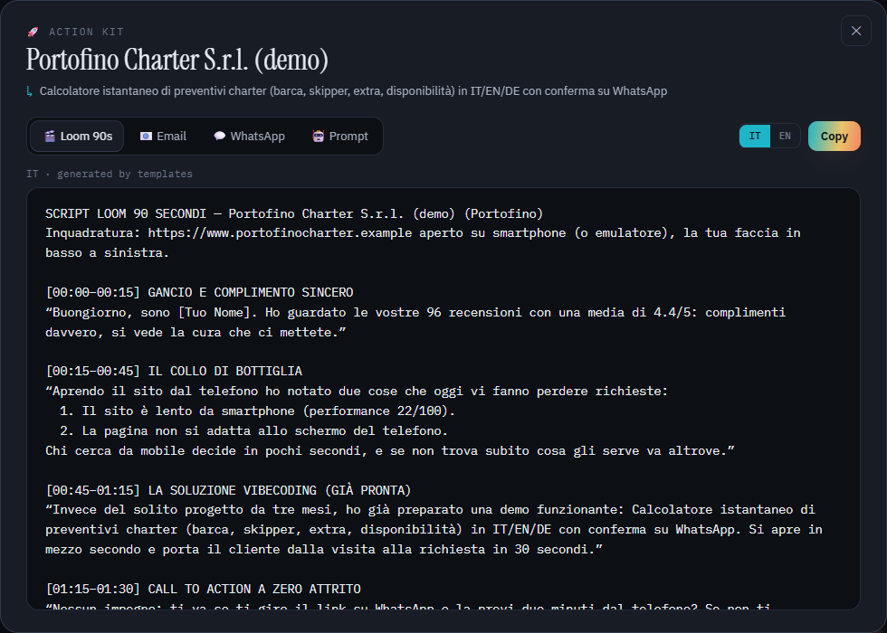
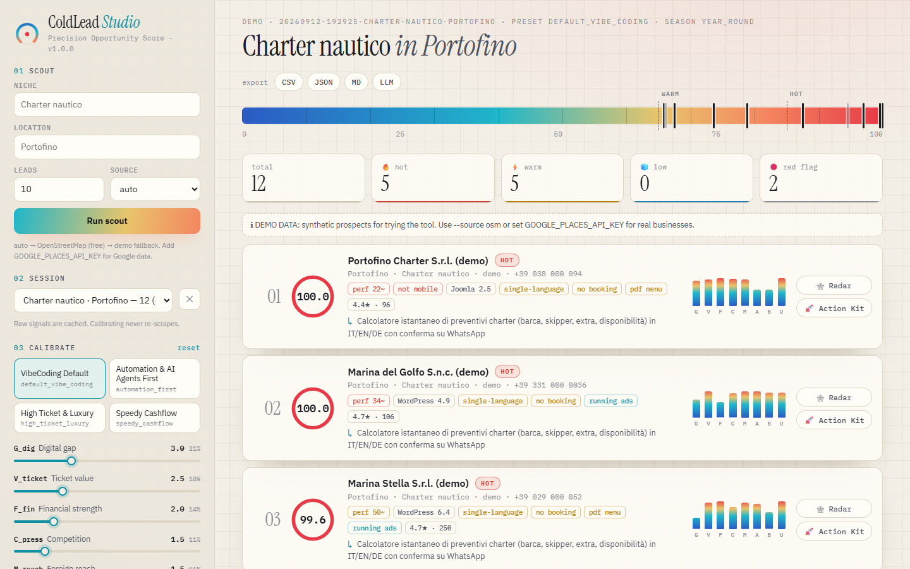

<div align="center">

# 🎯 ColdLead Studio

**Scrape once. Re-score forever.**
Scientific B2B lead scouting for VibeCoding studios — find the local businesses that most need
(and can afford) a 24-hour micro-app, rank them with a transparent 8-variable model, and walk away
with a ready-to-send outreach kit.

[](https://github.com/gabrielecrema/coldlead-studio/actions/workflows/ci.yml)


[](LICENSE)
[](https://github.com/astral-sh/ruff)

**CLI** · **MCP server** · **Agent skill** · **Local dashboard** — one engine, four surfaces.

[English](README.md) · [Italiano](README.it.md)



</div>

---

## Why

Classic scrapers hand you a flat list of names and phone numbers. You still don't know **who has
money, who is reachable, who is toxic, and what to pitch them**. ColdLead Studio answers exactly
that, with numbers you can inspect:

- 🧮 **Precision Opportunity Score (POS, 0–100)** from 8 normalized variables, context multipliers
  and hard red-flag filters — every point explained.
- ⚡ **Decoupled scoring.** Slow work (discovery, website audits, AI insights) runs once and is
  cached. Re-ranking with new weights is pure math: **~1 ms for a session**, from any surface.
- 🎛️ **Tamper with the weights post-scraping** — sliders in the dashboard, flags in the CLI,
  arguments in MCP — or pick a preset.
- 🚀 **Action Kit per lead**: 90-second Loom script, surgical cold email, WhatsApp opener
  (< 300 chars) and a VibeCoding prompt to build the prototype in Cursor / Claude Code / Antigravity.
- 🆓 **Zero-cost by default.** Works fully offline with realistic demo data, or live and free with
  OpenStreetMap. API keys only *upgrade* things.

## Quick start

```bash
# with uv (recommended) — or: pipx install "coldlead-studio[all] @ git+https://github.com/gabrielecrema/coldlead-studio"
uv tool install "coldlead-studio[all] @ git+https://github.com/gabrielecrema/coldlead-studio"

coldlead scout "Charter nautico" "Portofino" --source demo   # 30 seconds, no keys, no network
coldlead rescore -p high_ticket_luxury                       # instant re-rank from the cache
coldlead explain 1                                           # why is #1 on top?
coldlead kit 1                                               # outreach kit for #1
coldlead web                                                 # interactive dashboard
```

Drop `--source demo` to scout **real businesses** (Google Places if you have a key, otherwise
OpenStreetMap — free), with a live technical audit of every website.

<details>
<summary><b>Working from a clone</b></summary>

```bash
git clone https://github.com/gabrielecrema/coldlead-studio && cd coldlead-studio
uv sync --all-extras          # or: pip install -e ".[all]"
uv run coldlead --help
uv run pytest                 # 148 tests, fully offline
```
</details>

## The model

$$\mathrm{POS} = \left[\frac{\sum_i w_i \cdot V_i}{\sum_i w_i} \times 10\right] \times M_{ads} \times M_{friction} \times T_{win}\;(\times P_{lock\text{-}in})$$

| Weight | Variable | Default | What it measures |
|:---:|---|:---:|---|
| `w_G` | **G_dig** — Digital & AI readiness gap | 3.0 | Performance, mobile, HTTPS, legacy CMS, booking — or no site at all (= 10) |
| `w_T` | **V_ticket** — Ticket value & margin | 2.5 | Sector economics: yacht charter ≫ bar |
| `w_F` | **F_fin** — Financial strength | 2.0 | Legal form (S.p.A./S.r.l. vs sole trader) and headcount |
| `w_P` | **C_press** — Competitive pressure | 1.5 | How far the top-2 local rivals *in the same session* are ahead online |
| `w_I` | **M_reach** — Foreign-market friction | 1.5 | Tourism hubs / luxury niches served by a single-language site |
| `w_D` | **A_decision** — Decision-maker access | 1.5 | Owner on WhatsApp or mobile vs. chain HQ far away |
| `w_C` | **B_care** — Brand care | 1.0 | How often and how well the owner replies to reviews |
| `w_A` | **U_vibe** — VibeCoding surface | 1.0 | Manual processes a micro-tool replaces in 24h (PDF menus, no booking, no bot) |

**Multipliers** — running ads ×1.25 (they pay for traffic that doesn't convert) · critical friction
(no HTTPS / not mobile) ×1.15 · seasonal window ×1.4 autumn-winter, ×1.0 spring, ×0.5 summer peak
(`--season auto` picks it from today's date) · agency lock-in ×0.85.

**Red flags** discard a lead immediately: owners who insult reviewers or threaten lawsuits, and
businesses in liquidation or closed. **Tiers**: 🔥 Hot ≥ 85 · ⚡ Warm ≥ 65 · 🧊 Low.

Scores are capped at 100 but ranking uses the uncapped value, so ties at the ceiling stay ordered.
Every variable ships with human-readable reasons — see `coldlead explain` or the 🕸 Radar button.



Read the full specification in [docs/scoring.md](docs/scoring.md).

## Four surfaces, one engine



### 1. CLI — `coldlead`

| Command | What it does |
|---|---|
| `coldlead scout NICHE CITY [-n 10] [--source auto\|demo\|osm\|google]` | Discover, audit, enrich and cache a session |
| `coldlead rescore [-p PRESET] [-w w_A=4 ...] [--season ...] [--tier1 80]` | Re-rank the cached session instantly |
| `coldlead explain <rank\|id\|name>` | Variable-by-variable breakdown with reasons |
| `coldlead kit <rank\|id\|name> [--lang it\|en] [--ai]` | Loom · email · WhatsApp · VibeCoding prompt |
| `coldlead export -f csv\|json\|jsonl\|compact\|markdown [-o FILE] [--with-kits]` | Standardized exports |
| `coldlead import my_leads.csv [--city X] [--niche Y]` | Score *your own* list (IT/EN headers, `,` or `;`) |
| `coldlead audit https://example.com [--pagespeed]` | One-off technical audit |
| `coldlead web` / `coldlead mcp` | Dashboard / MCP server |
| `coldlead sessions` · `presets` · `config --init` · `schema` · `doctor` | Housekeeping |

Every command is pipe-friendly: `-f json`/`-f csv` writes clean data to stdout, messages go to stderr.

### 2. MCP server

Tools: `coldlead_search`, `coldlead_rescore`, `coldlead_explain`, `coldlead_generate_pitch`,
`coldlead_audit`, `coldlead_score`, `coldlead_list`, `coldlead_open_dashboard`.

```bash
claude mcp add coldlead -- coldlead mcp            # Claude Code
```

```jsonc
// Claude Desktop · Cursor · Windsurf · Antigravity (mcpServers block)
{ "mcpServers": { "coldlead": { "command": "coldlead", "args": ["mcp"] } } }
```

Then just ask: *"Find 10 boat charters in Portofino, re-rank them favouring automation, and write
the WhatsApp opener for the best one."* Remote agents can use `coldlead mcp --transport streamable-http`.

### 3. Agent skill & Claude Code plugin

The `coldlead-scout` skill teaches an agent the workflow and the model. It lives in
[`skills/`](skills/coldlead-scout/SKILL.md) (synced to `.claude/skills/` and `.agents/skills/`
for Claude Code and Antigravity). The repo is also a **Claude Code plugin marketplace**:

```text
/plugin marketplace add gabrielecrema/coldlead-studio
/plugin install coldlead-studio@coldlead-studio
```

### 4. Local dashboard — `coldlead web`

A "thermal instrument" UI: every lead is a tick on a cold→hot scale; drag any of the 8 weight
sliders and the ranking reorders live. Radar chart per lead (lead profile vs. your weights),
Action Kit modal with IT/EN copy and one-click export. No build step, no CDN required, works offline,
light & dark.

<table><tr>
<td></td>
<td></td>
</tr></table>

## Data sources & keys (all optional)

| Capability | Default (free) | Upgrade |
|---|---|---|
| Discovery | OpenStreetMap (Nominatim + Overpass) · offline demo | `GOOGLE_PLACES_API_KEY` — Places API (New) |
| Performance | Transparent heuristic from the homepage | `PAGESPEED_API_KEY` or `--pagespeed` — official Lighthouse |
| Ads | Meta Pixel / Google Ads tag detection | `META_AD_LIBRARY_ACCESS_TOKEN` — active ads in the Ad Library |
| Insights & copy | Deterministic heuristics & templates | `GEMINI_API_KEY` · `ANTHROPIC_API_KEY` · `OPENROUTER_API_KEY` · `OPENAI_API_KEY` · local Ollama |

Copy [`.env.example`](.env.example) to `.env`. `coldlead doctor` shows what is active.

## Configuration

Four layers, each overriding the previous one: **factory presets** → **`~/.coldlead/config.json`**
→ **environment** (`COLDLEAD_PRESET`, `COLDLEAD_SEASON`, `COLDLEAD_W_A`, …) → **runtime** (flags,
sliders, tool arguments).

```jsonc
// ~/.coldlead/config.json  (create a starter with: coldlead config --init)
{
  "default_preset": "my_luxury_automation",
  "season": "auto",
  "presets": {
    "my_luxury_automation": { "extends": "high_ticket_luxury", "weights": { "w_A": 2.0 } }
  }
}
```

Factory presets: `default_vibe_coding` · `automation_first` · `high_ticket_luxury` · `speedy_cashflow`.
Weights accept aliases: `-w automation=3` equals `-w w_A=3`.

## Output contract

Every surface emits the same **`POSLeadDossier` v1.0.0** record — `company`, `raw_signals`,
`enrichment`, `pos_evaluation` (score, tier, variables, explanations, weights, multipliers,
red flags) and optionally `action_kit`. The JSON Schema is published in
[`schema/pos-lead-dossier.schema.json`](schema/pos-lead-dossier.schema.json) (`coldlead schema`).

## Use it as a library

```python
from coldlead import demo_leads, resolve_config, score_leads

leads = demo_leads("Dentista", "Milano", limit=8)
for item in score_leads(leads, resolve_config(preset="automation_first", weights={"w_G": 4})):
    print(item.rank, item.evaluation.final_score, item.lead.company.name)
```

## Responsible use

ColdLead Studio audits **public homepages** with an identifying User-Agent, respects `robots.txt`
by default and keeps request volumes small. You are responsible for complying with the terms of
the data sources you enable and with privacy law (in the EU: B2B outreach on legitimate interest,
relevant messages, an easy opt-out — the email template includes one). Google Places content may
only be stored as the [Google Maps Platform terms](https://cloud.google.com/maps-platform/terms)
allow: delete old sessions with `coldlead sessions --delete <id>`. Demo data is synthetic: names are
marked "(demo)", phone numbers are zero-filled and domains use the reserved `.example` TLD.
OpenStreetMap data © OpenStreetMap contributors (ODbL).

## Contributing

Issues and PRs are welcome — see [CONTRIBUTING.md](CONTRIBUTING.md). The scoring engine is pure
and heavily tested, so new variables, presets, playbooks and providers are easy to add.

## License

[MIT](LICENSE) © 2026 Gabriele Crema
