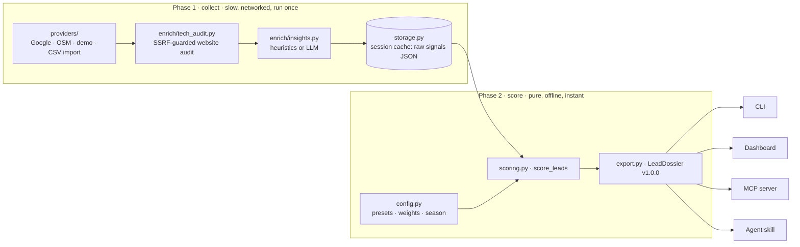

# Architecture

ColdLead Studio is one Python package (`src/coldlead/`) with one engine and four ways to drive it.
This page describes the code as it exists today; the scoring model itself is specified in
[scoring.md](scoring.md). The original pre-implementation vision is kept, for history only, in
[design-notes/](design-notes/2026-09-initial-vision.it.md).

## The core idea: collect once, score forever

Everything is split into two phases that never mix.

**Phase 1 — collection** (`pipeline.py`) discovers businesses, audits each website and adds
qualitative insights. It is the only part that touches the network, it can take minutes, and its
single output is a `Session`: a list of `Lead`s holding *raw signals only* (`models.py`). The
session is written atomically as a JSON file under `~/.coldlead/sessions/` (or `$COLDLEAD_HOME`).

**Phase 2 — scoring** (`scoring.py`, `variables.py`, `red_flags.py`) turns raw signals plus a
`ScoringConfig` into a ranking. `score_lead()` is a pure function: no I/O, no clock except the
optional `season="auto"` resolution done beforehand in `config.py`, no randomness. Scores are
never stored, so any change of weights, preset, season or thresholds is just a re-computation:
about 0.2 ms per lead on a laptop — under 3 ms for a default 10-lead session, ~12 ms for 60.

That split is what makes the product interactive: dashboard sliders, `coldlead rescore` and the
`coldlead_rescore` MCP tool all re-rank a cached session without a single request.

## Data model (`models.py`)

| Family | Models | Lifetime |
|---|---|---|
| Raw | `Company`, `RawSignals`, `Enrichment`, `Lead`, `Session` | persisted in the session cache |
| Derived | `POSEvaluation`, `RedFlag`, `ActionKit`, `LeadDossier` | recomputed on demand, never cached |

`None` in `RawSignals` always means *unknown*; every variable treats it as neutral and says so in
its reasons. `LeadDossier` is the public output contract, published as
[`schema/pos-lead-dossier.schema.json`](../schema/pos-lead-dossier.schema.json) and regenerated
with `coldlead schema`.

## Module map

| Area | Module | Responsibility |
|---|---|---|
| Orchestration | `pipeline.py` | `scout()`, `import_leads()`, provider fallback chain, progress events |
| Discovery | `providers/google_places.py` · `providers/osm.py` · `providers/demo.py` | Places API (New); Nominatim + Overpass; deterministic offline data |
| Audit | `enrich/tech_audit.py` | robots.txt, HTTPS fallback, CMS/stack, performance estimate, hreflang, booking/chat widgets, pixels, agency credits |
| Insights | `enrich/insights.py` · `enrich/llm.py` · `enrich/ads.py` | owner tone and levers; optional Gemini/Anthropic/OpenRouter/OpenAI/Ollama; Meta Ad Library |
| Domain data | `knowledge.py` | sectors, ticket values, tourism hubs, legal forms, red-flag vocabularies (English + merged packs) |
| Locale packs | `locales/en_US.py` · `locales/it_IT.py` | per-market demo data (names, LLC/S.r.l., phone formats, review replies) and local vocabulary |
| Scoring | `variables.py` · `scoring.py` · `red_flags.py` | 8 variables with reasons, multipliers, tiers, discards |
| Configuration | `config.py` · `presets.json` · `settings.py` | presets → `config.json` → env → runtime; API keys, language, country |
| Outreach | `outreach/playbooks.py` · `outreach/action_kit.py` | signal-driven offers; Loom script, email, WhatsApp, prototype prompt (EN/IT) |
| Output | `export.py` · `terminal.py` | JSON/JSONL/compact/CSV/Markdown; Rich tables and panels |
| Diagnostics | `doctor.py` | capability report behind `coldlead doctor` and the `coldlead_doctor` tool |
| Surfaces | `cli.py` · `web/` · `mcp_server.py` | Typer CLI; FastAPI + vanilla JS dashboard; MCP server |

## Four surfaces, one engine

Each surface is a thin adapter over the same functions, so a lead scored from the CLI, the
dashboard or an agent gets the same number and the same reasons.

1. **CLI** (`cli.py`, entry point `coldlead`). `scout` runs phase 1; `rescore`, `explain`, `kit`,
   `export` only load a session and run phase 2. Data goes to stdout, messages to stderr.
2. **Local dashboard** (`web/app.py` + `web/static/`). FastAPI on `127.0.0.1`; scouting runs as a
   background job with live progress; sliders call `/api/score`, which re-scores the cached
   session. No build step and no CDN (Leaflet is vendored).
3. **MCP server** (`mcp_server.py`, `coldlead mcp`), over stdio or streamable HTTP, with all three
   primitives: 9 tools (search, rescore, explain, audit, single-company scoring, pitch, listing,
   dashboard, `coldlead_doctor` backed by `doctor.py`), resources that serve cached sessions and
   dossiers (`coldlead://sessions/{session_id}[/leads/{lead_id}]`, the JSON Schema) without a tool
   call, and 3 workflow prompts (`prospecting_run`, `audit_and_pitch`, `refine_ranking`).
4. **Agent skill** (`skills/coldlead-scout/SKILL.md`, mirrored in `.claude/skills/` and
   `.agents/skills/`; `.claude-plugin/` makes the repo a Claude Code plugin marketplace). It
   teaches an agent the collect-once/score-forever workflow and prefers the MCP tools when present.

## Network behaviour and safety

- One identifying User-Agent and a neutral `Accept-Language: *` for every request
  (`settings.HTTP_HEADERS`), so multilingual sites are judged by their declared `hreflang`
  alternates, not by the language a server picked for us.
- Website audits are SSRF-guarded: http(s) only, public addresses only (checked per redirect hop
  and again at connection time), at most 5 MB read per response. See [SECURITY.md](../SECURITY.md).
- robots.txt is honoured by default; consecutive Nominatim lookups in a search are spaced by one
  second, and Overpass `429`/`504` answers are retried once, honouring `Retry-After`.
- Live sources never fall back to demo data silently: demo leads only appear when no live source
  answered, and are always marked `source: "demo"`, `(demo)` names, `.example` domains and
  fictitious phone numbers.

## Locale packs

Country- and language-specific knowledge is isolated in `src/coldlead/locales/`, one `Locale`
per market. Its **vocabulary** (Italian sector keywords, `S.r.l.` patterns, US tourism hubs …) is
merged into `knowledge.py` for every lead, so a niche typed in Italian still matches in Miami.
Its **demo data** is used only when that market is searched: `detect_locale()` picks the pack from
the place name (the rightmost, most specific mention wins, so "Naples, Florida" is American), then
from `COLDLEAD_COUNTRY`, then falls back to en-US. `COLDLEAD_COUNTRY` also sets the default
outreach language (`it` for Italy, `en` otherwise) unless `COLDLEAD_LANG` says otherwise.

## Where to extend

- **A new country**: one `locales/<xx_YY>.py` module registered in `locales.PACKS`.
- **A new signal**: add an optional field to `RawSignals`, fill it in a provider or in
  `tech_audit.analyze_html`, use it in a variable with an explicit reason, regenerate the schema.
- **A new provider**: implement the `Provider` protocol (`providers/__init__.py`) and add it to the
  chain in `pipeline.discover`.
- **A new preset**: `presets.json` (factory) or `~/.coldlead/config.json` (personal, with `extends`).
